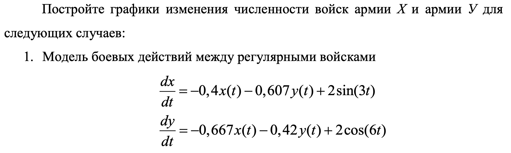
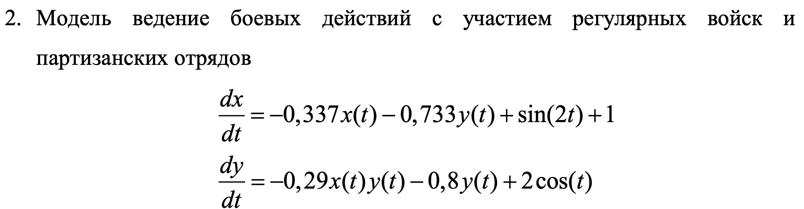
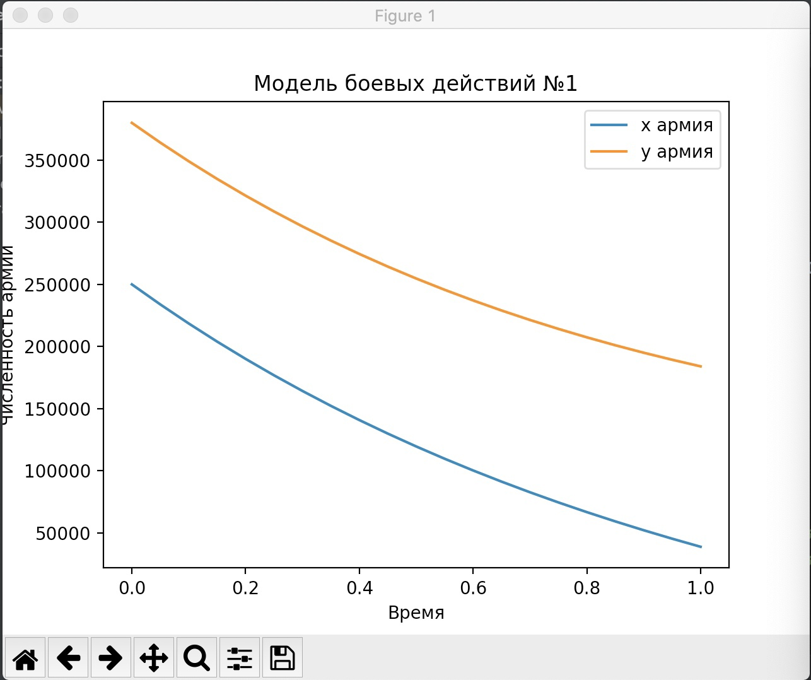
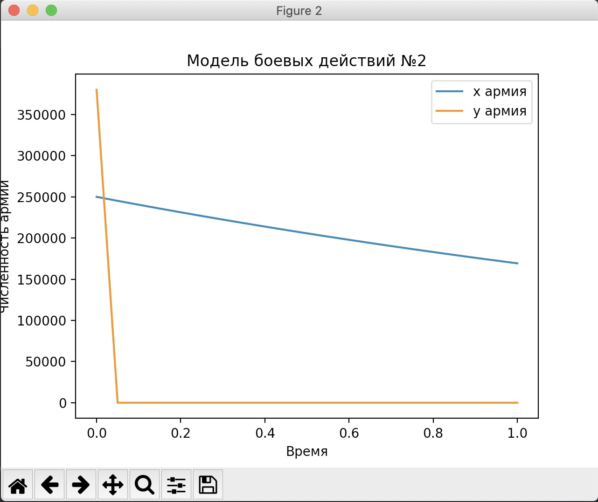

---
## Front matter
lang: ru-RU
title: Модель боевых действий
author: |
	Ухарова Софья Вячеславовна НФИбд-03-18\inst{}

institute: |
	\inst{}Российский Университет Дружбы Народов

## Formatting
mainfont: PT Serif
romanfont: PT Serif
sansfont: PT Sans
monofont: PT Mono
toc: false
slide_level: 2
theme: metropolis
header-includes: 
 - \metroset{progressbar=frametitle,sectionpage=progressbar,numbering=fraction}
 - '\makeatletter'
 - '\beamer@ignorenonframefalse'
 - '\makeatother'
aspectratio: 43
section-titles: true

---

## Цель работы

Ознакомиться с моделью боевых войск и построить графики

## Задание

{ #fig:003 width=60% height=60% }
{ #fig:003 width=60% height=60% }

## Код программы

Подключаю необходимые библиотеки
```bash
 import numpy as np
 import matplotlib.pyplot as plt
 from scipy.integrate import odeint
``` 
## Код программы
Ввожу значение х0 и у0 из своего варианта:
```bash
 x0 = 250000 
 y0 = 380000 
 t0 = 0 
```
## Код программы
Введу значения для модели 1 и обозначу t и v0:
```bash
 a = 0.4 
 b = 0.607 
 c = 0.667 
 h = 0.42 
 tmax = 1 
 dt = 0.05
 t = np.arange(t0,tmax+dt,dt)  
 v0 = [x0,y0] 
```

## Код программы
Зададим функции P и Q
```bash
def P_1(t): 
p = math.sin(2*t) 
return p 
def Q_1(t): 
q = 2*math.cos(6*t) 
return q 
```
## Код программы 
Теперь запишем само уравнение и выведем график
```bash
ans_1 = odeint(f_1,v0,t) 
fig1, ax1 = plt.subplots() 

ax1.plot(t, ans_1[:,0], label='x армия') 
ax1.plot(t, ans_1[:,1], label='y армия') 
ax1.set_xlabel('Время') 
ax1.set_ylabel('Численность армии') 
ax1.set_title("Модель боевых действий №1") 
ax1.legend() 
```
## Код программы
Ввожу значения для модели 2 :
```bash
a = 0.4 
b = 0.607 
c = 0.667 
h = 0.42 

```
## Код программы
Зададим функции P и Q, систему и само уравнение  для 2 модели:
```bash
def P_2(t): 
return math.sin(2*t)+1 
def Q_2(t): 
return 2*math.cos(t) 
def f_2(v,t): 
x,y = v 
return [-a*x-b*y+P_2(t),-c*x*y-h*y+Q_2(t)] 
ans_2 = odeint(f_2,v0,t) 
```
## Результирующие графики
{ #fig:003 width=50% height=60% }
{ #fig:003 width=60% height=50% }

## Вывод
В результате проделанной лабораторной работы я научилась работать с моделью и строить графики для двух случаев боевых действий
